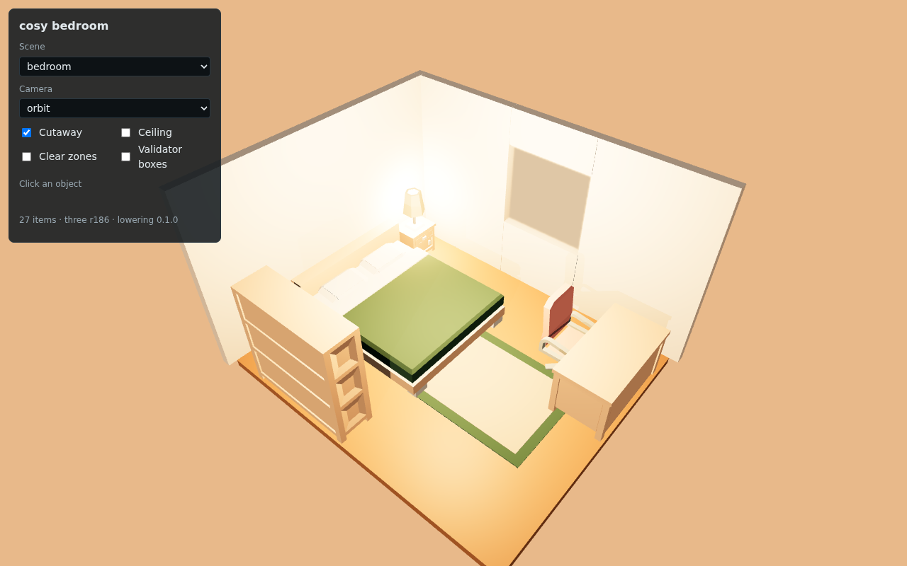
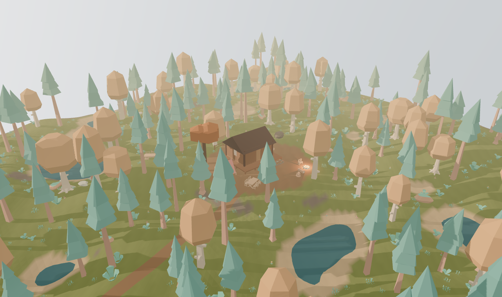
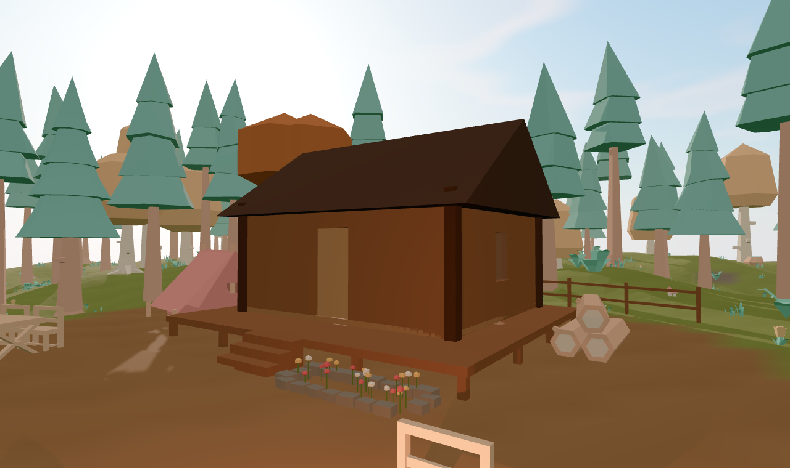
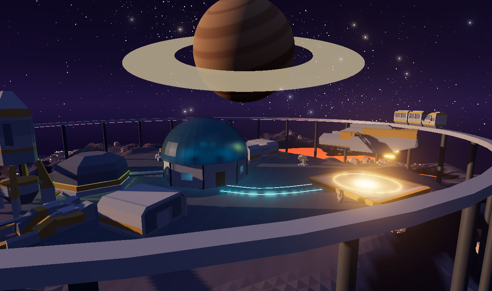
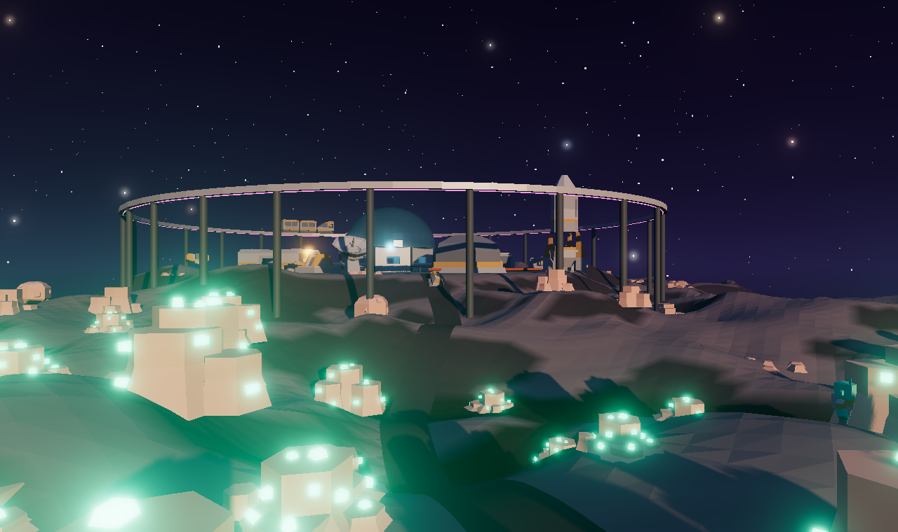
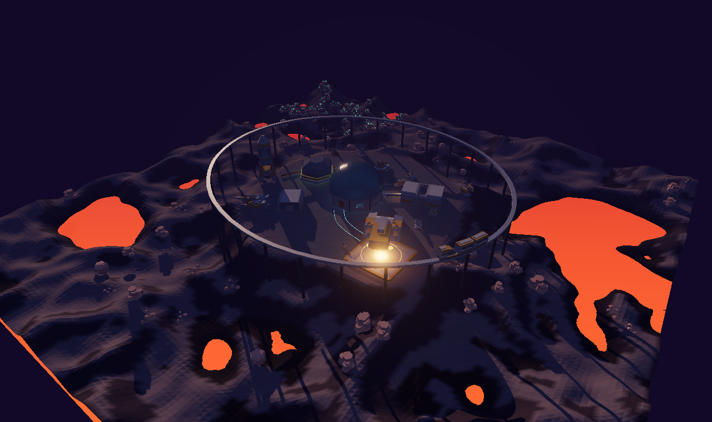
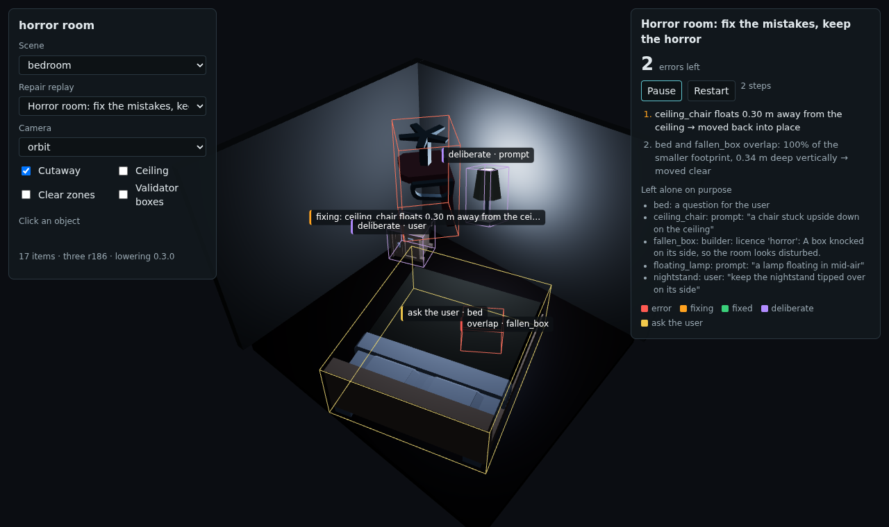
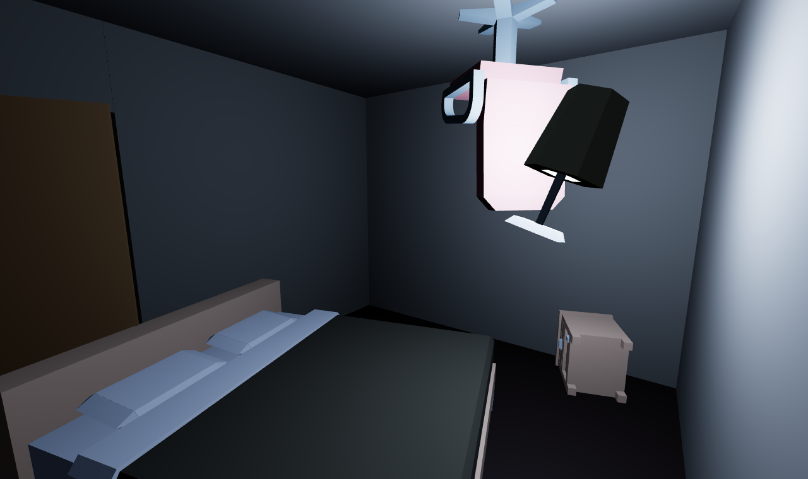

# World IR

The single source of truth for a generated 3D world. A world file is JSON, but its contents are a typed IR (intermediate representation): a scene tree of typed nodes, registries of assets and materials, terrain, parametric generators, declared relations, and checking rules. Three.js rendering, validators, the repair model's input text and the repair actions are all passes over this one file.

The full field-by-field reference is in [`docs/REFERENCE.md`](docs/REFERENCE.md). It is generated from the code, so it always matches the schema.

## The pipeline

```
Builder agent → World IR (agent writes nodes and relations; code fills asset and material entries)
             → Lowering (Python, world_ir/lower.py)  → Lowered scene ← validators read this
             → Loader (JavaScript, viewer/src/loader.js, three.js 0.186.1 pinned) → what you see
```

The repair model edits the World IR with actions; the result is lowered again and the viewer animates the change.

- **Lowering** turns rooms into a floor, a ceiling, wall pieces cut around doors and windows, door panels, window glass and door clearance zones; evaluates terrain (seeded noise, flatten, bump, smooth, carve-path, terrace and crater edits, material layers by height, slope and zone, a water level); lays paths on the ground; expands prefabs with per-instance overrides; scatters assets with area, spacing, slope, height and avoid rules; turns 23 generators into shapes, meshes and instances (platform, building with windows, door and roof, roof including domes, column, ramp, railing, fence, procedural tree, rock and bush, grass, flower bed, along-path, radial array, table set, shelving, kitchen run, rug, straight stairs, wall run, array, and sweep: a profile along a path for pipes, rails, monorail beams and neon strips, with posts down to the ground); records behaviours (spin, bob, sway, flicker, follow-path) for the loader to play; fills in material presets; and flattens nested transforms into world matrices. Water bodies, decals, text, audio, particles and a few generators (arch, bridge, road, parking lot, curtains, shelf fill, non-straight stairs) are listed in `unsupported` and skipped, while their children are still lowered.
- **The loader** only draws what lowering produced. It normalises each GLB (front to +Z, bottom centre to the origin, fitted to the asset's `dims`), tags every object with its IR node ID, highlights nodes, animates updates between two lowered scenes, and cuts away walls between the camera and the room. It also draws space skies (stars, planets with rings), adds bloom when the environment asks for it, and plays behaviours on top of each item's rest pose. `view.setTime(seconds)` freezes the animation for repeatable screenshots.
- **Behaviours are for show.** Items in the lowered scene keep their rest pose, which is what the validators check; the animation never changes what is validated.
- **Versions** are pinned and recorded in every lowered scene: IR version, lowering version, and the three.js version. Three.js does not follow semver (r186 removed `PCFSoftShadowMap`, for example), so upgrade only on purpose.













**Snapping.** An agent can say an object stands on the terrain but cannot know the ground height there. `snap_to_ground` (and `scripts/snap.py`) sets the height of every terrain-supported node from the terrain, the same way code fills in asset sizes. Scatter, fences, flower beds and paths follow the ground on their own.

## What a world file can contain

| Part | Count | Examples |
|---|---|---|
| Node kinds | 18 | group, asset, primitive, generator, prefab, room, terrain, water, path, scatter, zone, light, camera, marker, decal, text, audio, particles |
| Generators | 28 | stairs, ramp, roof, wall run, column, arch, fence, railing, bridge, building, platform, shelving, table set, kitchen run, shelf fill, rug, curtains, tree, rock, bush, grass, flower bed, road, along-path, parking lot, array, radial array, sweep |
| Terrain | 4 height sources, 7 edits, painted layers | noise, grid, image, flat; flatten, bump, smooth, carve path, terrace, crater, erosion |
| Relations | 46 in 7 groups | on, against wall, faces, near, around, clear, not blocking, walkway, count, requires, no overlap, max slope |
| Environment | sky (5 types), sun, ambient, fog (2 types), tone mapping, reflections, bloom, weather, wind | colour, gradient, procedural, HDRI, space (stars, milky way, planets, moons, rings) |
| Behaviours | 8 presets, 5 played | spin, bob, sway, flicker, follow path; open on approach, toggle on click, look at viewer |
| Registries | assets, materials (38 presets), prefabs | wood, metal, glass, terrain, lava, acid, ice, hull, neon |
| Repair actions | 12 in 3 tiers | move, rotate, scale; set support, reparent, swap asset, set material, set param, add node, remove node; add or remove relation |

In total the world format has 165 object types and 751 documented fields; with the lowered scene format, 180 and 840.

Every object and field carries a tier:

- **v1**: needed for the hackathon build: rooms, assets, lights, cameras, zones, the core relations and the v1 repair actions.
- **v2**: stretch: terrain, most generators, scatter, paths, prefabs, physics, space skies, bloom, behaviours.
- **later**: designed so the format won't need to change, but not planned: water bodies, audio, particles, decals, weather.

The world can describe much more than the repair model may change. The v1 repair model only edits `xform.pos`, `xform.yaw` and `xform.scale`.

## Validators

`validate(world)` lowers the world and measures what the viewer would draw. It returns a report of issues, each naming the node to edit, how far off it is, and usually a suggested fix written as a repair action.

| Check | What it measures |
|---|---|
| floating, sunk | The object's base against what holds it up: floor, terrain, the named surface of another object, or the ceiling (its top, for things hung there). `support: none` needs a reason: a category that floats by nature (ship, drone, bird...) or an intent. |
| upright | Tilt from vertical. |
| overlap | Footprints and heights of every pair of objects, except parts of one group or one resting on another. Allowed overlaps (chairs under tables) come from the rules or `allow_overlap` relations. |
| inside_wall, out_of_bounds | Footprints outside their room, objects off the terrain. |
| door_clearance | Objects inside a door's clearance zone or any zone that must stay clear. |
| scale | Height against a typical height for the category. |
| relations | 22 of the 46 relation kinds so far: on, near, faces, against_wall, inside_region, clear, not_blocking, no_overlap, count, requires, forbids, and more. The rest are listed as not checked yet. |

- **Severity.** `error` must be fixed; `warning` is a broken soft relation; `ask` is something odd that may be deliberate, put to the user instead of repaired; `info` is waived by intent, shown but never repaired.
- **Tolerances scale with the object** (`rules.relative_tolerance`), so a teacup and a tower are judged alike.
- **Fixes go to the right node.** Collisions move the whole group or prefab instance; turns and heights edit the object itself, in its parent's frame.
- **`report.as_text()`** is what the repair model reads. `as_text(hints=True)` adds the suggested fixes.
- **`greedy_repair(world)`** applies the suggested fixes round by round and undoes any round that makes the score worse. It is the baseline the trained model has to beat, and the source of worked examples for training.

Validating the bedroom takes about 3 ms; the outdoor worlds about a second, almost all of it terrain.

## Training data, scoring and replays

- **Bug injector** (`world_ir/inject.py`): plants labelled mistakes in clean worlds: lift, sink, push into a wall, collide, block a door, turn, tilt, scale. A bug is kept only if the validators report a new error for it, so every label is true, and each one carries its oracle undo. Decoys make an object float on purpose (the brief gains a sentence, the object gains an intent quoting it), so a model also learns what not to fix.
- **Repair text** (`repair_text.py`): what a repair model reads: instructions, rooms and objects in parent space, and the issue list. Provenance is left out, so the model never sees which objects were tampered with.
- **Reward** (`reward.py`): `score_repair(world, actions)` applies the actions and lets the validators judge: errors fixed, errors added, edit size, and deliberate oddities or user questions undone. Invalid output and edits to locked nodes score -1. This is the GRPO reward.
- **Baseline** on 76 room tasks (`scripts/eval_repair.py`): the rule-based repairer fixes 75% of errors and leaves 45% of worlds clean, adding 0.29 errors per task; the oracle reaches 100%. That gap is what the trained model has to close.
- **Replays** (`replay.py`, `patch.py`): a repair recorded one action at a time, each step stored as a small scene patch. The viewer plays them back in place (moves, grow-ins, shrink-outs, colour fades) with coloured outlines and labels: red errors, orange the fix in progress, green fixed, purple deliberate, yellow questions for the user. Open `index.html?replay=horror_repair&autoplay`.



## Deliberate oddness

Validators never decide what a scene should look like; they check that it matches what it says it intends. A horror room with a chair stuck to the ceiling must not be "repaired" back to the floor, so the builder writes the intent down, with the user's own words as evidence:

```json
{ "kind": "asset", "id": "ceiling_chair", "asset": "chair_desk",
  "support": { "on": "ceiling" }, "xform": { "pos": [2.5, 2.6, 2.1], "rot": [180, 40, 0] },
  "intent": [{ "allows": ["upright"], "source": "prompt", "quote": "a chair stuck upside down on the ceiling" }] }
```

- Only the waived check is skipped. The chair is still checked against the ceiling, so if it hangs 10 cm low the repair moves it up, toward what was asked.
- The quote must appear in the prompt (`source: prompt`), in a later user message (`brief.messages`, `source: user`) or in an approved reference caption (`source: image_brief`). A builder cannot excuse its own mistakes by calling them deliberate.
- Floating, sunk, upright, overlap, facing and scale can be waived from the prompt. Inside-wall, out-of-bounds, door clearance and reachability can only be waived by the user.
- Near misses are still mistakes: a waived check keeps flagging gaps under `rules.deliberate_min_offset` (15 cm) and tilts under `rules.deliberate_min_tilt_deg` (15°). Nobody floats a lamp 3 cm on purpose.
- The builder can make its own design choices too, without being asked. Instead of a quote it names a **licence**: a mood, style or archetype the brief really has and that allows oddness (`horror`, `abandoned`, `surreal`, ... see `ODDNESS_LICENCES`), plus a note saying why, which the user sees. Builder intents are capped (`rules.max_builder_intents`), never cover the hard checks, and are frozen once checking starts: `intent_changes(built, repaired)` lists any intent added, changed or removed after the build, and the orchestrator rejects those steps. So the builder can plan oddness, but cannot excuse a mistake after the validators have found it.
- How the builder organises a scene is stated as relations with `source: "builder"` (`faces`, `around`, `row`, `symmetric`, `visible_from`, `clear`, ...). Validators check them and repairs must keep them.
- A waiver covers the node and everything under it. `World.waiver(node_id, check)` returns the intent that applies, or `None`.
- Large breaks that nothing explains, in a scene whose brief allows oddness, are asked about rather than repaired (`rules.ask_when_unexplained`).

`examples/horror_room.json` uses all of this: a chair on the ceiling, a floating, flickering lamp, a bed shoved against the door, a nightstand the user asked to keep tipped over, and a box the builder knocked over on its own, licensed by the brief's `horror` mood.



## Conventions

- Metres, degrees, kilograms. +Y up, right-handed. An asset's front faces +Z (glTF).
- An asset's origin is the bottom centre of its box, so `pos[1]` is the height of its base.
- Transforms are local to the parent node: a lamp on a nightstand moves with it.
- IDs are lowercase slugs, unique across the file. Walls are `"<room_id>:<edge>"`.
- Unknown fields are rejected. Tool-specific data goes in `extras`.

## Layout

```
world_ir/        Pydantic models: the schema itself
  common.py        shared types, Transform, Support, Semantic, Physics, Provenance
  environment.py   sky (including space skies), sun, ambient, fog, bloom, weather, wind
  assets.py        AssetDef, Material, material presets
  architecture.py  Opening (doors, windows), RoofSpec
  terrain.py       height sources, terrain edits, material layers
  generators.py    the 28 parametric generators
  nodes.py         the 18 node kinds
  relations.py     the 46 relations
  world.py         World, Brief, ValidationRules, Prefab, cross-reference checks
  actions.py       repair actions, constrained_schema(), apply_v1()
  catalogue.py     reads the models for the generated docs
  lowered.py       the lowered scene format
  lower.py         lowering: World IR → lowered scene (rooms, terrain, paths, prefabs, scatter, behaviours)
  lower_generators.py  generators → shapes, meshes and instances
  terrain_eval.py  noise, terrain edits, layers, ground height
  geometry.py      matrices, colour, roof, dome, rock and sweep meshes
  snap.py          put terrain-supported nodes on the ground
  validate.py      the validators: issues, severities, suggested fixes, repair-model text
  baseline.py      rule-based repair from the suggested fixes
  inject.py        the bug injector: labelled bugs, oracle undos, decoys
  repair_text.py   the repair model's input text
  reward.py        scoring a repair with the validators
  patch.py         scene patches: what changed between two lowered scenes
  replay.py        repairs recorded step by step for the viewer
examples/        minimal.json, bedroom.json, horror_room.json, cabin_clearing.json, scifi_colony.json
viewer/          three.js loader (src/loader.js), page and replay player (src/app.js), lowered scenes, replays, Kenney CC0 models
schema/          generated JSON Schemas for worlds, actions and lowered scenes
docs/            generated REFERENCE.md and catalogue.json
tests/           validation, cross-reference, intent, lowering, validator and action tests
```

## Use

```bash
pip install -e ".[dev]"
pytest                                                    # schema, lowering and action tests
python scripts/build_docs.py                              # regenerate schema/ and docs/ after changing world_ir/
python scripts/lower.py examples/*.json --out-dir viewer/scenes   # regenerate the scenes the viewer loads
python scripts/measure_assets.py viewer/assets/kenney/furniture --scale 1.9   # asset dims from the GLBs (needs trimesh)
python scripts/measure_assets.py viewer/assets/kenney/nature --height tree-pinetalla=9   # or a real height per model
python scripts/fix_glb_metalness.py viewer/assets/kenney/nature   # some kits mark leaves and fabric as metal
python scripts/fix_glb_metalness.py viewer/assets/kenney/space --metal 0.35   # and some mark every hull colour fully metallic
python scripts/snap.py examples/scifi_colony.json                  # ground heights for terrain-supported nodes
python scripts/validate.py examples/*.json --hints                  # check worlds; --repair applies the suggested fixes
python scripts/make_tasks.py examples/*.json --count 200 --out tasks.jsonl   # training tasks
python scripts/eval_repair.py examples/*.json --count 30            # score noop, rule-based and oracle repairs
python scripts/replay.py --demo                                     # record the demo replays in viewer/replays/

cd viewer && npm install && npm run serve                 # then open http://localhost:8000/?scene=bedroom
```

```python
from world_ir import World, apply_v1, constrained_schema

world = World.model_validate_json(open("examples/bedroom.json").read())

# JSON Schema for one repair answer on this world. Object IDs are an enum of the
# world's unlocked nodes, so a model decoding with it cannot name a missing object.
schema = constrained_schema(world, tier="v1")

fixed = apply_v1(world, [{"action": "move", "id": "desk_chair", "to": [0.9, 0, 2.4]}])
```

Loading a world checks more than field types: every reference to a node, asset, material, prefab, opening, zone, path or wall must resolve, node IDs must be unique, openings must fit their walls, and nodes may use at most one way of giving a rotation.

## What does not go in the world file

Keep these in separate files that point at the world by ID:

- Validator results (the issue list).
- The history of actions applied, with before and after.
- Training labels, such as which bug the injector planted. The world only marks injected nodes with `source.by = "injector"`.
- Renders and screenshots.

## Adding to the IR

1. Add a model with a literal tag (`kind`, `gen`, `rel` or `action`), a docstring and a description on every field. Set its tier with `model_config = cfg("v2")`.
2. Add it to the union and to the group list at the bottom of its module.
3. Mark fields that name other objects with `json_schema_extra=ref("node")` (or `asset`, `material`, ...); the world then checks them on load.
4. Run `python scripts/build_docs.py` and `pytest`. A test fails if the generated schema is stale.
5. Implement it where it is used: the Three.js generator, the validators, or both. A kind that no pass understands should stay at tier `later`.
